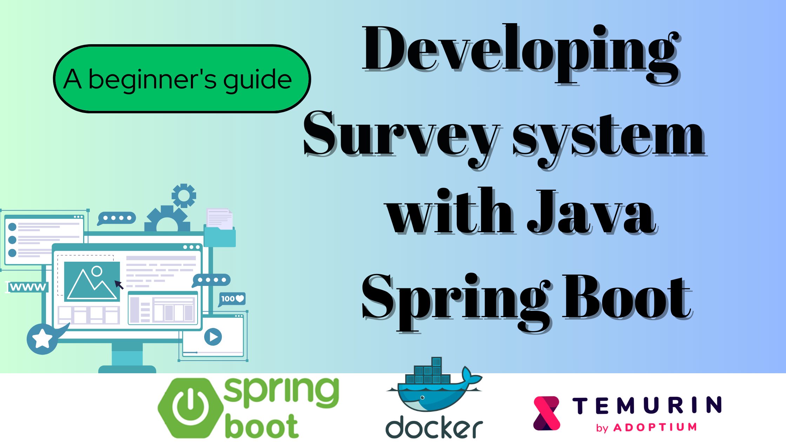
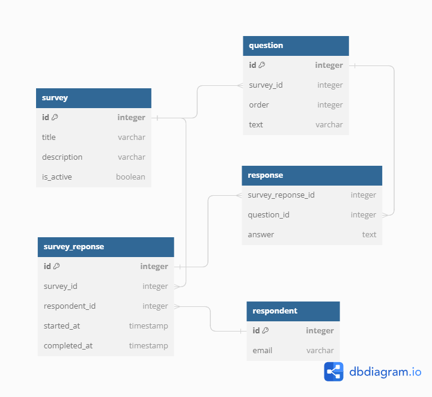
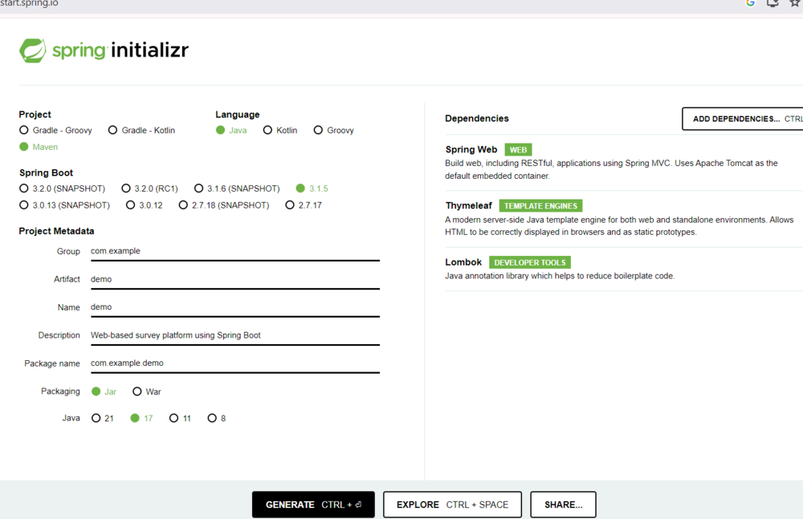
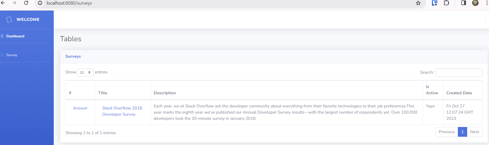
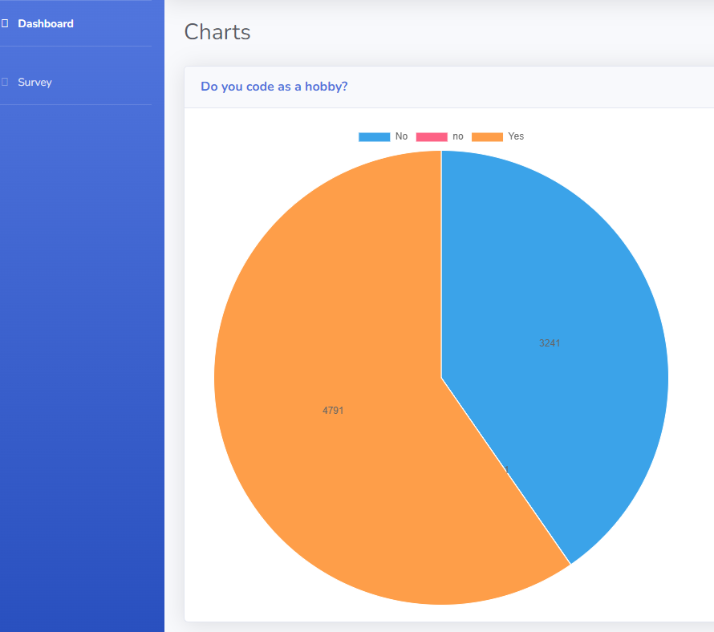

Developing a Web-Based Survey Platform with Java Spring Boot: A Beginner’s Guide
===



## What is a survey platform?

A survey is a research method used to collect data from a group of people. It is a tool that can be used to gather information about opinions, behaviors, and other characteristics of a population. Surveys can be conducted in various ways, such as through interviews, questionnaires, or online forms.

Web-based survey platforms are becoming increasingly popular due to their many benefits. Here are some of the advantages of using web-based survey platforms:

* Faster: Web-based surveys can be completed more quickly than traditional methods because participants can respond at their own pace and from anywhere with an internet connection.
* More Accurate: The margin of error is significantly reduced with online surveys because participants enter their responses directly into a web survey. Since respondents record their own answers, there is no opportunity for an interviewer to misinterpret a response.
* Visually Engaging: Web-based surveys can include multimedia elements such as images and videos to make them more engaging and interactive.

Web-based survey platforms offer a variety of features and functional requirements that can help you create effective surveys. Here are some of the most common features available in web-based survey tools:

- Question Types: Web-based survey platforms offer a variety of question types, such as multiple-choice, open-ended, rating scales, and more.
- Skip Logic: Skip logic allows you to customize the flow of your survey based on the respondent’s answers. It enables you to skip irrelevant questions and show only those relevant to the respondent.
- Real-time Analytics: Web-based survey platforms provide real-time analytics that allows you to track responses as they come in and analyze data in real-time.
- Mobile Compatibility: Web-based surveys can be optimized for mobile devices, making it easy for respondents to complete surveys on their smartphones or tablets.
- Integration with Other Tools: Web-based survey platforms can integrate with other tools such as email marketing software, CRM systems, etc.

## What We're Building

In this tutorial, we'll be creating a web-based survey platform that leverages the power of Spring Boot and GridDB.
For now, we will start with implementing open-ended questions, and the respondent can submit multiple responses.
Finally, there will be a report showing the answers and the percentage of the answers per question.

### Requirements

Based on the previous overview, we will have the following functional requirements:

1. Display a list of surveys, responses, and answers
2. Record answers
3. Visualize answers in table and chart

The out of scope:
* User management (register, login, etc)
* Survey management (create, edit, delete)

> In this tutorial we will seed our application with survey data from CSV files.

### Where should we store the data?

The choice between SQL and NoSQL databases depends on specific requirements. However, here are some reasons why NoSQL databases are preferred over SQL databases for this system:

1. Horizontal scalability: NoSQL databases typically provide easy horizontal scalability.
2. Query Structure: In this case, there is no need for complex relational operations such as table joins.
3. NoSQL databases are typically built with a distributed and decentralized architecture, enabling easy scaling by adding more nodes to the cluster.

### Class diagram for online survey

Next, let's tackle database design and high-level architecture.
The class diagram for the survey platform is shown below.



### Database design for online survey

From the above class diagram, we will create a database schema with the following attributes:

- Survey

  This is the starting point for our system. This entity contains core information about each survey generated in the system. It has the following attributes:
    *  `String id`: System generated unique identifier. It is the primary key.
    *  `String title`: The overview of the survey
    *  `String description`: The description for the purpose of the survey
    *  `boolean isActive`: A boolean value that indicates whether the survey is still valid
    *  `Date createdAt`: System-generated timestamp of survey creation


- Question

  This entity contains the questions available for a survey. It has the following attributes:
    *  `String id`: System generated unique identifier. It is the primary key.
    *  `String surveyId`: The ID to identify the parent survey
    *  `String questionText`: The text of the question
    *  `Integer position`: The order of the question among the questions in the survey


- SurveyResponse

  This entity contains information about the response and the moment of start and finish responding to a survey. It has the following attributes:
    *  `String id`: System generated unique identifier. It is the primary key.
    *  `String surveyId`: The ID to identify the parent survey
    *  `Date startedAt`: The date and time when the respondent starts responding to the survey
    *  `Date completedAt`: The date and time when the respondent finishes responding to the survey.


- Answer

  This entity contains the respondent's answer for each question in the survey. It has the following attributes:
    *  `String id`: System generated unique identifier. It is the primary key.
    *  `String surveyResponseId`: The ID to identify the parent survey's response
    *  `String answer`: The date and time when the respondent starts responding to the survey
    *  `Date createdAt`: The date and time when the respondent finishes responding to the survey.


## How to Set up the Project

### What you can do with Spring Boot

Spring boot offers a fast way to build applications. 
Spring Boot does not generate code to make edits to your files. Instead, when you start your application, Spring Boot dynamically wires up beans and settings and applies them to your application context.
With Spring Boot, we can focus more on the business features and less on the infrastructure.

### What you need to install

- [Java 17 or later](https://jdk.java.net/21/), [Maven 3.5+](https://maven.apache.org/download.cgi), and your favorite text editor ([Intellij IDEA](https://spring.io/guides/gs/intellij-idea/), or [VSCode](https://spring.io/guides/gs/guides-with-vscode/))

### Create a Spring Boot Project

Navigate to [start.spring.io](https://start.spring.io/). This service pulls in all the dependencies you need for an application and does most of the setup.
Follow the screenshot below then click generate, it will generate the Spring Boot project and download it as a zip.


Now unzip this project and import it into any IDE.<br>
Next, we need to add additional library needed in this project as follows:
```xml
<dependencies>
<!-- Include log4j2 -->
<dependency>
  <groupId>org.springframework.boot</groupId>
  <artifactId>spring-boot-starter-log4j2</artifactId>
</dependency>
  
<dependency>
  <groupId>com.github.griddb</groupId>
  <artifactId>gridstore</artifactId>
  <version>5.1.0</version>
</dependency>

<dependency>
  <groupId>com.github.f4b6a3</groupId>
  <artifactId>tsid-creator</artifactId>
  <version>5.2.5</version>
</dependency>
<dependency>
  <groupId>de.siegmar</groupId>
  <artifactId>fastcsv</artifactId>
  <version>2.2.2</version>
</dependency>

</dependencies>
```

### Coding
#### Data access with GridDB

First, we create Java POJO classes that represent the underlying table or container in GridDB.
We annotate a class with Lombok @Data, which automatically generates getters for all fields, a useful toString method, and hashCode and equals implementations that check all non-transient fields. Also generate setters for all non-final fields, as well as a constructor.

```java
@Data
public class Survey {
    @RowKey String id;
    String title;
    String description;
    boolean isActive;
    Date createdAt;
}

@Data
public class SurveyResponse {
  @RowKey String id;
  String respondentId;
  String surveyId;
  Date startedAt;
  Date completedAt;
}

@Data
public class Answer {
  @RowKey String id;
  String surveyResponseId;
  String questionId;
  Date createdAt;
  String answer;
}

@Data
public class Question {
  @RowKey String id;
  String surveyId;
  String questionText;
  Integer position;
}

@Data
public class Respondent {
  @RowKey String id;
}
```
<br>

Next, we create the `GridDBConfig` class as a central configuration for database operation.
The class will do the following:
* Read environment variables for connecting to the GridDB database
* Create a GridStore class for managing database connection to the GridDB instance
* Create GridDB Collection's container (Table) to manage a set of rows. The container is a rough equivalent of the table in a relational database.
* On creating/updating the Collection we specify the name and object corresponding to the column layout of the collection.
  Also for each collection, we add an index for a column that is frequently searched and used in the condition of the WHERE section of TQL.

```java
@Configuration
public class GridDBConfig {

  @Value("${GRIDDB_NOTIFICATION_MEMBER}")
  private String notificationMember;

  @Value("${GRIDDB_CLUSTER_NAME}")
  private String clusterName;

  @Value("${GRIDDB_USER}")
  private String user;

  @Value("${GRIDDB_PASSWORD}")
  private String password;

  @Bean
  public GridStore gridStore() throws GSException {
    // Acquiring a GridStore instance
    Properties properties = new Properties();
    properties.setProperty("notificationMember", notificationMember);
    properties.setProperty("clusterName", clusterName);
    properties.setProperty("user", user);
    properties.setProperty("password", password);
    GridStore store = GridStoreFactory.getInstance().getGridStore(properties);
    return store;
  }

  @Bean
  public Collection<String, Survey> surveyCollection(GridStore gridStore) throws GSException {
    Collection<String, Survey> collection = gridStore.putCollection("surveys", Survey.class);
    return collection;
  }

  @Bean
  public Collection<String, Respondent> respondentCollection(GridStore gridStore)
      throws GSException {
    Collection<String, Respondent> collection =
        gridStore.putCollection("respondents", Respondent.class);
    return collection;
  }

  @Bean
  public Collection<String, SurveyResponse> surveyResponseCollection(GridStore gridStore)
      throws GSException {
    Collection<String, SurveyResponse> collection =
        gridStore.putCollection("surveyResponses", SurveyResponse.class);
    collection.createIndex("surveyId");
    collection.createIndex("respondentId");
    return collection;
  }

  @Bean
  public Collection<String, Question> questionCollection(GridStore gridStore) throws GSException {
    Collection<String, Question> collection = gridStore.putCollection("questions", Question.class);
    collection.createIndex("surveyId");
    return collection;
  }

  @Bean
  public Collection<String, Answer> answerCollection(GridStore gridStore) throws GSException {
    Collection<String, Answer> urlCollection = gridStore.putCollection("answers", Answer.class);
    urlCollection.createIndex("surveyResponseId");
    return urlCollection;
  }
}
```

#### Service class

Next, we create a service class with @Service annotation for handling business logic and convert the Entity class into DTO.
For example, the `SurveyService.java` is responsible for finding, and creating survey data in GridDB.

- `create`: Creating a new survey row. This method receives data from a web request (`SurveyWebController`) and then assigns the value to a new Survey entity.
  For saving the entity into the GridDB database, we call the `put` method from the `surveyCollection` bean created before.

```java
public String create(SurveyCreateRequest request) {
    Survey survey = new Survey();
    survey.setId(KeyGenerator.next("survey"));
    survey.setActive(request.isActive());
    survey.setTitle(request.getTitle());
    survey.setDescription(request.getDescription());
    survey.setCreatedAt(new Date());
    try {
      log.info("put: {}", survey);
      surveyCollection.put(survey.getId(), survey);
    } catch (GSException e) {
      e.printStackTrace();
    }
    return survey.getId();
  }
```

- `getSurvey`: For finding rows from GridDB, first we build TQL (a query language used by GridDB) with parameter `surveyId`, then create Query object to execute the TQL `surveyCollection.query(tql)`.
  To get the set of rows we call the `fetch()` method.

```java
  public SurveyDto getSurvey(String surveyId) {
    String tql = String.format("select * from surveys where id='%s'", surveyId);
    List<SurveyDto> surveyDtos = query(tql, true);
    if (surveyDtos == null || surveyDtos.size() == 0) {
      throw new ResponseStatusException(NOT_FOUND, "Not found");
    }
    return surveyDtos.get(0);
  }

  public List<SurveyDto> getSurveys() {
    String tql = "select * from surveys limit 50";
    return query(tql, false);
  }

  private List<SurveyDto> query(String tql, boolean includeQuestion) {
    List<SurveyDto> result = new ArrayList<>();
    Query<Survey> query;
    try {
      query = surveyCollection.query(tql);
      RowSet<Survey> rs = query.fetch();
      while (rs.hasNext()) {
        Survey model = rs.next();
        List<QuestionDto> questions = new ArrayList<>();
        if (includeQuestion) questions = questionService.getQuestions(model.getId());
        result.add(
            SurveyDto.builder()
                .id(model.getId())
                .createdAt(model.getCreatedAt())
                .description(model.getDescription())
                .title(model.getTitle())
                .isActive(model.isActive())
                .questions(questions)
                .build());
      }
    } catch (GSException e) {
      e.printStackTrace();
    }
    return result;
  }

```
<br>

### Serving Web Content with Spring MVC

Spring's web MVC framework is, like many other web MVC frameworks, request-driven, designed around a central Servlet that dispatches requests to controllers and offers other functionality that facilitates the development of web applications.
By using Spring MVC Framework we got the following advantages:
* The Spring MVC separates each role, where the model object, controller, command object, view resolver, etc. can be fulfilled by a specialized object.
* It uses a lightweight servlet container to develop and deploy your application.
* It provides a robust configuration for both framework and application classes that includes easy referencing across contexts, such as from web controllers to business objects.
* It provides the specific annotations that easily redirect the page.

In this tutorial, we will follow a standard MVC architecture.
We will have a controller (`SurveyWebController` class), views (`surveys.html` Thymeleaf template), and a model (a Java map object) for passing data into the view.
Every method of the controller is mapped to a URI.

#### Surveys page 

In the following example, `SurveyWebController`, method `listSurveys` handles GET requests for `/surveys` by returning the name of a View (in this case, `surveys`),
also adding attribute `surveys` to `Model` via its `addAttribute` method. To provide the attribute value (List of Survey) we call `surveyService.getSurveys()` method.

```java
@Controller
public class SurveyWebController {
    
  @GetMapping("/surveys")
  public String listSurveys(Model model) {
    model.addAttribute("surveys", surveyService.getSurveys());
    return "surveys";
  }
}

```

After creating the controller class, we need to define the template for the views to be generated.
We are using Thymeleaf, a modern server-side Java template engine for both web and standalone environments.
The HTML templates written in Thymeleaf still look and work like HTML.
In the following example, `surveys.html`, the model attributes can be accessed with the following syntax: `${attributeName}`, where the attributeName, in this case, is `surveys`.
We define an HTML table for displaying a list of surveys and use `th:each` tag attribute to iterate over a collection of surveys, and `th:text` tag for displaying the value.


```html
  <div class="table-responsive">
  <table class="table table-bordered" id="dataTableSurvey">
    <thead>
    <tr>
      <th scope="col">#</th>
      <th scope="col">Title</th>
      <th scope="col">Description</th>
      <th scope="col">Is Active</th>
      <th scope="col">Created Date</th>
    </tr>
    </thead>
    <tbody>
    <tr th:each="survey : ${surveys}">
      <td>
        <a class="nav-link" th:href="@{/responses/{surveyId}(surveyId=${survey.id})}">Answer</a>
      </td>
      <td>
        <a class="nav-link" th:href="@{/surveys/{surveyId}/responses(surveyId=${survey.id})}" th:text="${survey.title}"></a>
      </td>
      <td th:text="${survey.description}"></td>
      <td th:text="${survey.isActive}? 'Yups': 'No'"></td>
      <td th:text="${survey.createdAt}"></td>
    </tr>
    </tbody>
  </table>
</div>
```

- For answering the survey we provide an answer link in the table.
- For viewing the response list we can navigate through the survey title. From the response list, we can navigate to the answer.

Here is a preview of the survey list page.
<br /><br />



#### Chart page


Here is a preview of the chart page:
<br /><br />



### Running the Project with Docker Compose

To spin up the project we will utilize Docker, a popular container engine.
Containers help ensure that the application runs as expected on any machine.
Docker gives us access to Docker Compose, a tool we can use to orchestrate multiple containerized applications together.  

- `dev.Dockerfile`:  We use a Maven docker image with JDK21 

```dockerfile
FROM maven:3.9.5-eclipse-temurin-21-alpine
RUN mkdir /app
WORKDIR /app

COPY pom.xml ./
RUN mvn dependency:go-offline

COPY docker-entrypoint-dev.sh ./
COPY src ./src
```

- `docker-entrypoint-dev.sh` : in this script, we want to compile the code every time the code changes

```shell
#!/bin/bash
export TERM=xterm
echo "wait 5s"
sleep 5

mvn spring-boot:run -Dspring-boot.run.jvmArguments="-agentlib:jdwp=transport=dt_socket,server=y,suspend=n,address=*:5005" &

while true; do
    watch -d -t -g "ls -lR . | sha1sum" && mvn compile
done
```

- `docker-compose-dev.yml`

```yaml
version: '3.3'
services:
  survey-app-dev:
    container_name: survey-app-dev
    build:
      context: ./
      dockerfile: dev.Dockerfile
    volumes:
      - ./src:/app/src
      - ./.m2:/root/.m2
    environment:
      - GRIDDB_NOTIFICATION_MEMBER=griddb-dev:10001
      - GRIDDB_CLUSTER_NAME=dockerGridDB
      - GRIDDB_USER=admin
      - GRIDDB_PASSWORD=admin
      - spring.thymeleaf.prefix=file:src/main/resources/templates/
    command: sh ./docker-entrypoint-dev.sh
    ports:
      - 8080:8080
      - 35729:35729
      - 5005:5005
    networks:
      - griddb-dev-net
    depends_on:
      - griddb-dev

  griddb-dev:
    container_name: griddb-dev
    build:
      context: ./dockergriddb
      dockerfile: Dockerfile
    volumes:
      - griddb-dev-vol:/var/lib/gridstore
    ports:
      - 10001:10001
    networks:
      - griddb-dev-net

networks:
  griddb-dev-net:
volumes:
  griddb-dev-vol:
```

Then run the following commands:

1. Build the docker image:
```shell
  docker compose -f .\docker-compose-dev.yml build
```

2. Run the docker image:
```shell
  docker compose -f .\docker-compose-dev.yml up up
```

The website available at http://localhost:8080

## Conclusion

We have learned how to make a web-based survey platform using Spring Boot and GridDB as a database.
We also learned how to develop using Docker Compose. With the appropriate use of Docker and Docker Compose, we can easily port entire development environments to other developer's machines with minimal local environment configuration, including a local database, and a website.
For the next iteration, we can add more functionality such as security, user management, and surveys management, and provide more analytics use cases.
The repo for this project can be found [here](https://github.com/alifruliarso).
